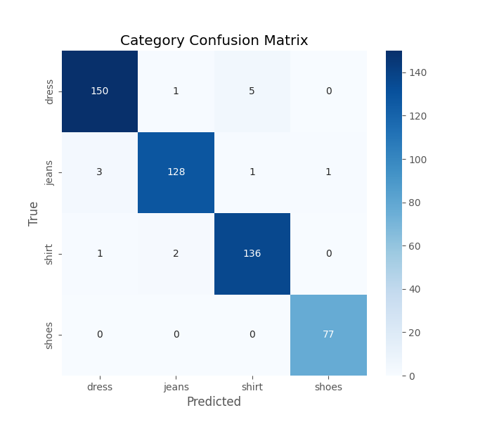
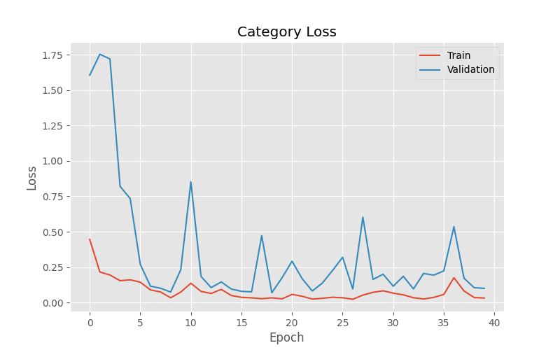
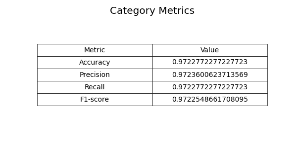
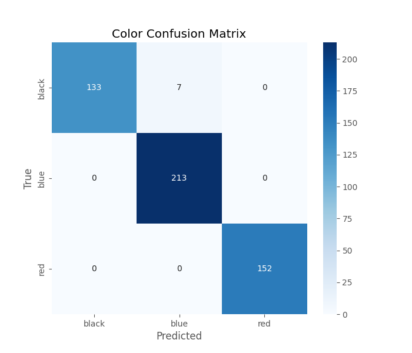
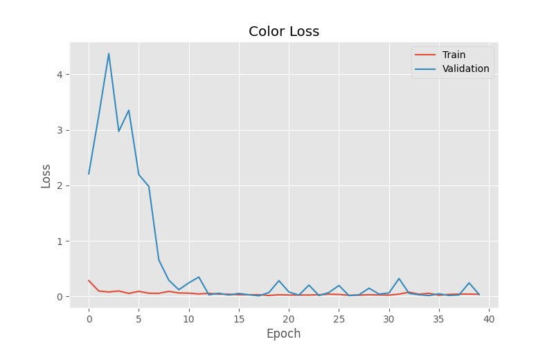
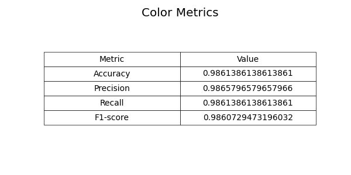
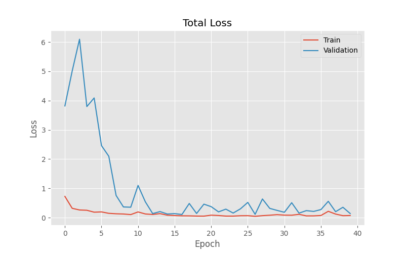

# Multi-Task Fashion Classification with Keras Functional API

This project implements a **multi-task convolutional neural network (CNN)** that simultaneously predicts the **category** and **color** of clothing images. The model is built using the **Keras Functional API**, enabling flexible architecture with shared feature extraction and task-specific output branches. Separate losses, configurable loss weights, and structured evaluation metrics ensure robust multi-task learning.

---

## Table of Contents

- [Dataset](#dataset)  
- [Project Overview](#project-overview)  
- [Keras Functional API](#keras-functional-api)  
- [Label Encoding](#label-encoding)  
- [Data Splitting](#data-splitting)  
- [Multi-Output Network](#multi-output-network)  
- [Loss Functions & Weighting](#loss-functions--weighting)  
- [Training](#training)  
- [Evaluation & Visualization](#evaluation--visualization)  
- [Results](#results)  
- [Repository](#repository)  

---

## Dataset

The dataset contains clothing images labeled with both **category** and **color**.  
All images are resized to **96×96 pixels** and normalized to `[0,1]`.

| Category & Color | Number of Images |
|------------------|------------------|
| black_jeans      | 344              |
| black_shirt      | 358              |
| blue_dress       | 386              |
| blue_jeans       | 356              |
| blue_shirt       | 369              |
| red_dress        | 380              |
| red_shirt        | 332              |

- **Split**: 80% training, 20% testing  
- Each image retains both labels to ensure alignment across tasks  

---

## Project Overview

- **Objective**: Predict clothing **category** (jeans, dress, shirt) and **color** (red, blue, black) simultaneously.  
- **Approach**: Multi-task CNN using **Keras Functional API**.  
- **Advantages**:
  - Shared feature extraction reduces redundancy  
  - Task-specific branches allow specialized learning  
  - Separate losses improve optimization and interpretability  

---

## Keras Functional API

The **Functional API** allows flexible network definitions with multiple inputs, multiple outputs, and shared layers.  
In this project, a shared input layer feeds into two distinct branches:

```python
net = models.Model(
    inputs=input_layers,
    outputs=[cat_net, col_net],
    name="fashionNet"
)
```

---

## Label Encoding

Labels are converted to one-hot vectors using `LabelBinarizer` from `scikit-learn`.

**Advantages**:
- Direct support for string labels  
- Compatible with `categorical_crossentropy`  
- Simple and reliable  

---

## Data Splitting

Data is split with `train_test_split`:

```python
train_test_split(
    all_images,
    category_labels,
    color_labels,
    test_size=0.2,
    random_state=42
)
```

- Ensures 80/20 split  
- Maintains consistent pairing of category and color labels  

---

## Multi-Output Network

The network produces two outputs from a single image input:

- `category_output`: clothing category  
- `color_output`: clothing color  

Early layers are shared, while each branch has its own convolutional and dense layers.  

---

## Loss Functions & Weighting

Each output has its own loss:

```python
losses = {
    "category_output": "categorical_crossentropy",
    "color_output": "categorical_crossentropy"
}
```

Loss weights balance contributions:

```python
loss_weights = {"category_output": 1.0, "color_output": 1.0}
```

---

## Training

Training with `model.fit`:

```python
history = model.fit(
    x=train_X,
    y={"category_output": train_Category_Y, "color_output": train_Color_Y},
    validation_data=(test_X, {"category_output": test_Category_Y, "color_output": test_Color_Y}),
    epochs=EPOCHS,
    verbose=VERBOSE
)
```

Recommended callbacks: `ModelCheckpoint`, `EarlyStopping`, `ReduceLROnPlateau`.

---

## Evaluation & Visualization

### Category
  
  
  

### Color
  
  
  

### Combined
  

Metrics include Accuracy, Precision, Recall, and F1-score.  
Confusion matrices provide class-level insights.

---

## Results

- Multi-task learning improves efficiency and knowledge transfer compared to separate models.  
- Shared features accelerate convergence.  
- Task-specific branches capture unique patterns.  
- Final model saved as: [`model/fashion_net.keras`](model/fashion_net.keras)

---

## Repository

Full source code and instructions available at:  
[GitHub Repository](https://github.com/sinabalaei/fashion-classifier)

---

**Author: Sina Balei**
